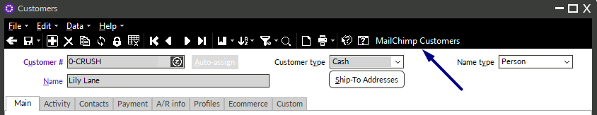
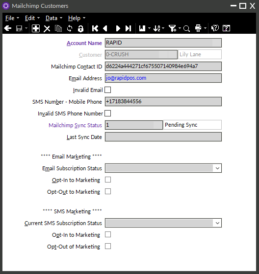
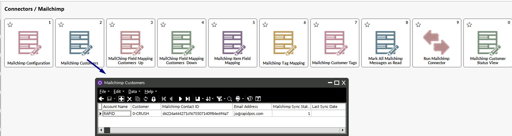
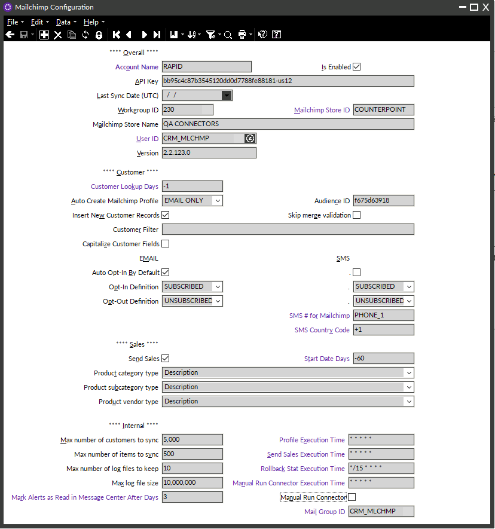
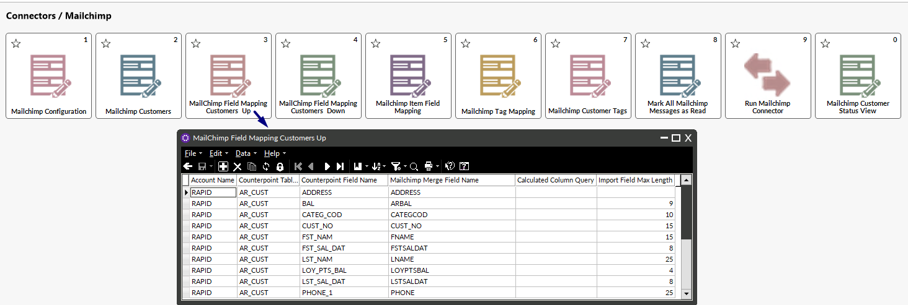
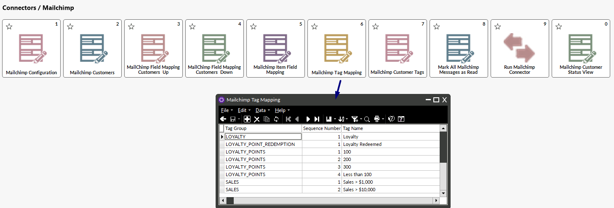
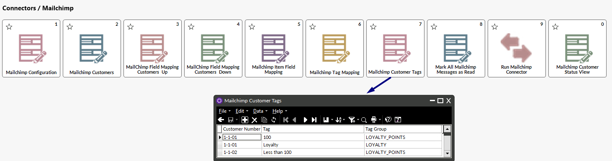

# Rapid POS Mailchimp Connector - Version 3.00.00 - Coming Soon
Updated 02/20/2026

---

## Overview

The Rapid Mailchimp Connector automatically syncs customer and sales data from Counterpoint to Mailchimp to support targeted email campaigns and audience segmentation. It can also import new or updated customer information from Mailchimp back into Counterpoint, ensuring both systems stay up to date.

If configured, **Phone 1** or **Mobile Phone 1** can be included to support Mailchimp SMS Marketing

---

## Minimum System Requirements:
- Minimum Counterpoint version: **8.5.6.2**  
- Minimum SQL Server version: **2016**  
- Minimum Windows Server version: **2016**  
- Minimum PowerShell version: **5.1**  

If you would like the Mailchimp connector but your system does not meet these minimum requirements, please consult your Care Team Lead (vCIO) for an upgrade quote.

---

## Table of Contents

- [Minimum System Requirements](#minimum-system-requirements)
- [SECTION 1: Mailchimp Customer Records](#section-1-mailchimp-customer-records)
- [SECTION 2: Mailchimp Configuration](#section-2-mailchimp-configuration)
- [SECTION 3: Mailchimp Field Mapping Customers Up](#section-3-mailchimp-field-mapping-customers-up)
- [SECTION 4: Mailchimp Field Mapping Customers Down](#section-4-mailchimp-field-mapping-customers-down)
- [SECTION 5: Mailchimp Item Field Mapping](#section-1-mailchimp-audiences-and-contacts)
- [SECTION 6: Mailchimp Tag Mapping](#section-3-ticket--item-information)
- [SECTION 7: Mailchimp Customer Tags](#section-9-mailchimp-customer-status-view)
- [SECTION 8: Mark All Mailchimp Messages as Read](#section-11-mark-all-mailchimp-messages-as-read)
- [SECTION 9: Run Mailchimp Connector Button](#section-10-run-mailchimp-connector-button)
- [SECTION 10: Mailchimp Customer Status View(#section-11)]
- [SECTION 11: Mailchimp Connector Execution and Sync Timing](#section-12-mailchimp-connector-execution-and-sync-timing)
- [SECTION 12: Mailchimp Connector Execution and Sync Timing]
- Mailchimp Connector Execution and Sync Timing
- [Conclusion](#conclusion)

---

## SECTION 1: Mailchimp Customer Records

The Mailchimp Connector adds a **Mailchimp Customers** button within Counterpoint, providing access to Mailchimp-specific customer fields directly from the Counterpoint customer record.

The email address on the Mailchimp customer record is populated from **Email Address 1** on the Counterpoint customer record.

Depending on configuration, the SMS phone number is populated from either **Phone 1** or **Mobile Phone 1** on the Counterpoint customer record, **only when it meets the following criteria**:
- Contains **exactly 10 numeric digits**
- Does **not** include letters

If the configured phone number field contains more than or fewer than 10 digits, or if it includes letters, the SMS number will **not** be pushed to Mailchimp.

### Accessing Mailchimp Customer Records

All Mailchimp customer records can also be accessed from:

**Connectors > Mailchimp > Mailchimp Customer Records**

This view allows records to be displayed in **table view**, where filters can be applied to review customers based on their current sync status.

### Mailchimp Sync Status Codes

Each Mailchimp customer record includes a sync status value indicating its current state in the sync process:

- **0** – Fully synced; nothing pending  
- **1** – Recently created or updated; will sync on the next connector run  
- **2** – Profile is currently in the active sync queue  
- **5** – Invalid email address  
- **6** – Invalid SMS number  
- **9** – Sync error; requires remediation before it can be re-synced  

### Add-on-the-Fly Mailchimp Customer Form (Optional)

An optional **Mailchimp Customers Add-on-the-Fly** form can be configured to give cashiers limited access to Mailchimp customer records, if desired.

Please contact Rapid for a quote if you are interested in a customized add-on-the-fly form for your company.

---
## SECTION 2: Mailchimp Configuration

The Mailchimp connector includes several configuration options that control how it interacts with Mailchimp and Counterpoint. These settings should be reviewed carefully during setup and adjusted only when necessary. All configuration settings are managed in **Counterpoint > Connectors > Mailchimp > Mailchimp Configuration**. 

For clients who use **multiple Mailchimp accounts**, a separate configuration record will exist for each account.

### Account Name
- Identifies the Mailchimp account.
- This setting is especially important for companies with more than one Mailchimp account (for example, separate accounts for a retail store and a restaurant).

### Is Enabled?
- Used to temporarily disable the connector while troubleshooting or testing.

### API Key
- The API Key identifies the Mailchimp account and provides the authentication credentials required for the connector to communicate with Mailchimp.
- Rapid will populate this field during installation.

### Last Sync Date (UTC)
- Displays the timestamp of the most recent connector run.
- This value is automatically updated after each sync and is used to determine which records have changed since the last sync.

### Workgroup ID
- Specifies which Counterpoint Workgroup ID should be used when creating new customers imported from Mailchimp.
- This will be a special workgroup for the Mailchimp connector so that a custom `CRM_MLCHMP` customer template can be used if needed.

  > **Default:** `230` (Mailchimp Connector)
- This value should typically remain unchanged unless otherwise instructed by Rapid.

### Mailchimp Store ID and Store Name
- Each Mailchimp connector instance is associated with a Mailchimp Store ID and Mailchimp Store Name.
- These store settings in Mailchimp are used for syncing sales data labeled as coming from Counterpoint (as opposed to other sources such as a separate ecommerce integration).

  > **Default Value:** `Counterpoint`
- These values typically should not be changed.

### User ID
- Defines the Counterpoint User ID that will be assigned to new customers imported from Mailchimp (only if customer import is enabled).

  > **Default:** `CRM_MLCHMP`
- This ensures all imported records are attributed to the designated Mailchimp connector user.

### Version
- Displays the current version of the Mailchimp connector.
- This field updates automatically when the connector is upgraded and is provided for reference only.

### Customer Lookup Days
- Defines the number of days subtracted from the current date when retrieving customer profiles from Mailchimp.
- This adjustment helps compensate for timezone differences and ensures recently updated customer records are included during synchronization.

### Auto Create Mailchimp Profile
Controls when Mailchimp customer records are automatically created from Counterpoint.

- **EMAIL ONLY**  
  A Mailchimp customer record is automatically created when a customer is added to Counterpoint with **Email Address 1**.
  - If the configured phone number (**Mobile Phone 1** or **Phone 1**) is also present, it will be included on the Mailchimp profile.
  - SMS subscription configuration is handled separately.

- **NO**  
  Mailchimp customer records must be created manually.

- **BOTH**  
  A Mailchimp customer record is automatically created only when both:

- **Note:**  
  **SMS ONLY** is currently a placeholder for potential future development. At this time, **all customers must have an email address** to be synced to Mailchimp.

### Audience ID
- Mailchimp organizes contacts within **Audiences** (formerly known as lists).
- This field identifies the specific audience to which connector data will sync.
- The Audience ID is established during setup and should not be modified unless a new audience is being used.

### Insert New Customer Records

Controls whether Mailchimp profiles can create new Counterpoint customer records.

| Setting | Behavior |
|---|---|
| **Checked** | Unmatched Mailchimp profiles will be inserted as new Counterpoint customer records. |
| **Unchecked** | Unmatched Mailchimp profiles will not be inserted as new Counterpoint customer records. |

#### When Checked

Customer records are created using fields configured in **Mailchimp Field Mapping – Customers Down** with an **Insert** action.

This option is commonly used when customer data originates from website sign-up forms.

#### Matching Logic

The connector attempts to match records using:

- Mailchimp Profile ID
- Email Address 1

If no match is found in either:

- Counterpoint customer records (`AR_CUST`)
- Mailchimp customer records (`USER_MAILCHIMP_CUST`)

A new Counterpoint customer record is created.

All profiles changed since the last sync are evaluated, regardless of Mailchimp audience membership.

> [!IMPORTANT]
> - Updating existing Counterpoint customer records is independent of this setting. Refer to **Mailchimp Field Mapping – Customers Down**.
> - Importing customers can result in duplicate records if email addresses were not previously captured in Counterpoint.
> - Duplicate records can be merged manually, but duplicates may be especially problematic for clients using **DL Scan** or **3310 forms**.
> - Consult with your **Business Analyst**, **vCIO**, or **Project Manager** before enabling this feature.

### Skip Merge Validation

Some clients configure **required merge fields** in Mailchimp, often to enforce required fields on website sign-up forms.

When those fields are missing values in Counterpoint, Mailchimp normally rejects the sync and returns an error.

Enabling **Skip Merge Validation** allows the connector to:

* Bypass merge field validation
* Force the customer record to sync

This prevents missing fields from blocking synchronization.

### Customer Filter

SQL query configuration used to filter and select customer records for synchronization to Mailchimp.

### Capitalize Customer Fields Configuration Setting

Supports automatic capitalization of customer fields during synchronization and processing.

| Setting | Behavior |
|---|---|
| **Checked** | Customer information, including names and address-related fields, is automatically converted to uppercase formatting to maintain data consistency between Counterpoint and Mailchimp customer records. |
| **Unchecked** | Customer information is synchronized using the original text formatting without automatic capitalization. |

### Auto Opt-In by Default

Controls whether the opt-in value is automatically selected when creating a new Mailchimp customer record.

| Setting | Behavior |
|---|---|
| **Checked** | The opt-in box is automatically selected when a new Mailchimp customer record is created. |
| **Unchecked** | The opt-in box must be manually selected or provided through another process. |

This setting is intended to reduce manual steps during customer creation.

### Opt-In Definition

Defines the Mailchimp subscription status used when a customer is opted in.

Currently, the supported opt-in definition is:

- `SUBSCRIBED`

### Opt-Out Definition

Defines the Mailchimp subscription status used when a customer is opted out.

Currently, the supported opt-out definition is:

- `UNSUBSCRIBED`

### SMS # for Mailchimp

Defines which Counterpoint customer phone number field is used to populate the Mailchimp **SMS Number – Mobile Phone** profile property.

Supported options include:

- `Mobile Phone 1`
- `Phone 1`

If the selected phone field does not contain exactly **10 numeric digits**, the phone number will not be sent to Mailchimp.

> This setting determines which phone number is sent to Mailchimp. It does **not** control SMS subscription consent.

### SMS Country Code

Defines the country code added to SMS phone numbers sent to Mailchimp.

Mailchimp requires all SMS phone numbers to include a country code.

Examples:

| Country | Code |
|---|---|
| United States and Canada | `+1` |
| Mexico | `+52` |

### Send Sales

Controls whether sales data is synchronized from Counterpoint to Mailchimp.

| Setting | Behavior |
|---|---|
| **Checked** | Sales data is sent from Counterpoint to Mailchimp. |
| **Unchecked** | Only customer data is synchronized. |

When checked, sales activity can be used in Mailchimp for audience segmentation, reporting, and targeted marketing.

### Start Date Days  
Defines how many days of historical sales data should be pushed during the **initial** sync.  
- The default value is **-60 days**, meaning that sales from the past 60 days will be pushed to Mailchimp during the first sync. However, this value can be adjusted as desired.

### Product Category, Subcategory, and Vendor Type  
Mailchimp provides only a **single product category field** (previously referred to as the *product vendor* field). Some clients choose to include additional item details — such as **category**, **subcategory**, or **vendor** — in this field to enhance reporting and segmentation in Mailchimp.

Because Mailchimp does not support multiple fields for these values, Rapid developed a **workaround** that combines all three into the single **Category** field available in Mailchimp. This approach allows for more flexible audience segmentation but requires awareness of how combined data impacts filtering and search behavior.

>**Example of combined values:**  
>
>| **Field** | **Description** | **Code** |
>|------------|-------------------------------|------------------------|
>| Category | `Fruits & Vegetables` | `FRUIT&VEG` |
>| Subcategory | `Tropical Fruits` | `TROPFRUITS` |
>| Vendor | `Golden Grove Company` | `GOLDENGROVE` |

When combined, these values are sent to Mailchimp as a single entry in Mailchimp's Category field.

Example of all three values sent as description: `Fruits & Vegetables/Tropical Fruits/Golden Grove Company`  

  

Example of all three values sent as code: `FRUIT&VEG/TROPFRUITS/GOLDENGROVE`  

  

Example of only category sent as a code: `FRUIT&VEG`  

  

When the configuration is defined, consideration should be given to how segments will be created in Mailchimp:
- For **specific filtering** (e.g., *Category **equals** Tropical Fruits*), sending a single data type — such as only category or only subcategory — produces the most precise results.  
- For **broader filtering** (e.g., *Category **contains** “Fruit”*), combined category, subcategory, and vendor values may **all** contribute to the match.  
  - In this scenario, filtering for *contains “Fruit”* would return any record where the word “Fruit” appears in **any** portion of the combined field.

Example of filtering using the operator **contains**:  

  

### Internal Configuration Options  
Additional internal configuration options exist within the connector. These are primarily used by programmers to optimize performance or to assist in troubleshooting. These values should not be adjusted by end users.

---

## SECTION 3: Mailchimp Field Mapping - Customers Up

The **Mailchimp Field Mapping – Customers Up** screen provides a user interface for managing which customer fields are sent from Counterpoint up to Mailchimp.

This table defines how customer profile data in Counterpoint maps to Mailchimp profile properties. The standard deployment includes a predefined set of fields that are automatically synced. Adjustments to this table should generally be performed by a programmer.

Note: This is best viewed in _table view_.

Calculated fields are not included by default. Any request to add calculated fields must be reviewed and quoted separately by Rapid.

**Note:** **Email Address 1** is a required field and must be sent to Mailchimp.

### Standard Customer Profile Fields Sent to Mailchimp

The following customer fields are included in a standard Mailchimp connector deployment:

1. Email 1 _(Required and hard-coded, not included in the mapping table)_
2. Customer Number *  _(Strongly recommended)_
3. First Name  
4. Last Name  
5. Full Address _(Address + City + State + Zip)_  
6. Zip Code *  
7. Phone 1 
8. Customer Category  
9. First Sale Date  
10. Last Sale Date  
11. Loyalty Point Balance  
12. A/R Account Balance

\* Must be sent as **merge field column type = default.**

### Keep the following points in mind:

#### Addresses

Mailchimp requires the **full customer address** to be combined into a single field with a column type of `address`. Accordingly, **Address 1**, **Address 2**, **Address 3**, **City**, **State**, and **Zip Code** are merged and sent to Mailchimp as one field.

If you would like to send these fields individually (for example, **Zip Code** for audience segmentation), you can also configure them as separate custom fields.

When importing customer address information into Counterpoint, ensure that the merge field column type is set to `address`. Mailchimp will then separate each address component for proper import into Counterpoint.

#### Birthdays

If birthday information is stored in Counterpoint, it can be sent to Mailchimp as a custom field with the merge field column type set to `birthday`.  

Mailchimp only accepts **month and day** — not the year — so the connector removes the year before sending the data.

When importing customers from Mailchimp, birthdays are imported into Counterpoint as MM/DD/1900.  
- The year **1900** is added automatically because Mailchimp omits the year, but Counterpoint requires it for date fields.

#### Calculated Fields

In some cases, **calculated fields** can also be sent to Mailchimp. These requests are reviewed and quoted individually by Rapid programmers.

Example of a calculated field:
- The date a customer last purchased a product in a specific category.

---

## SECTION 4: Mailchimp Field Mapping – Customers Down

The **Mailchimp Field Mapping – Customers Down** table provides a user interface for managing which customer fields are imported from Mailchimp down into Counterpoint.

For clients using web-based sign-up forms or other Mailchimp integrations, this functionality allows customer data entered in Mailchimp to be imported into Counterpoint. This may include:
- Updating (overwriting) existing customer fields in Counterpoint
- Inserting new Counterpoint customer records when no matching record exists

Note: This is best viewed in _table view_.

### Default Behavior

In a standard deployment, **no fields are imported** from Mailchimp. All fields in the table are set to **No Action** by default.

Any change to this behavior must be requested by the client, and a programmer will configure the table accordingly.

### Action Types

Each field in the **Customers Down** mapping table is assigned an action type that controls how Mailchimp data is applied in Counterpoint:

- **Insert Only**  
  The field is set by Mailchimp in Counterpoint **only when a new Counterpoint customer record is created**.

- **Update Existing**  
  When the field value changes in Mailchimp, the corresponding field in Counterpoint is updated.  
  This action does **not** set the field during new customer creation.

- **Insert and Update**  
  The field is set by Mailchimp when a new Counterpoint customer record is created, and it is also updated in Counterpoint when the value changes in Mailchimp.

- **No Action**  
  The field is not set or updated by Mailchimp in Counterpoint.

**Note:**  
- The two action types that include **Insert** only function when the configuration option **Insert New Customer Records** is enabled.  
- The two action types that include **Update** will function regardless of that configuration setting.

Use caution when selecting which Mailchimp fields are allowed to overwrite Counterpoint data. Consult with your **Business Analyst (BA)** for guidance before enabling field updates.

### Retain Counterpoint Value if Mailchimp is Empty

This setting controls how blank values from Mailchimp are handled during import:

- **Checked**  
  Counterpoint will **not** be updated with blank values from Mailchimp.  
  This prevents scenarios where a customer leaves a field blank on a web-based sign-up form, unintentionally overwriting existing Counterpoint data.

- **Unchecked**  
  Allows existing Counterpoint values to be overwritten with blank values from Mailchimp.  
  This setting is **not recommended**.

---
## SECTION 5: Mailchimp Item Field Mapping  
The Mailchimp connector now includes item field mapping support, allowing Counterpoint item data to be mapped to Mailchimp item attributes used during product and sales synchronization.
This configuration defines how item-related fields from Counterpoint are sent to Mailchimp so that product details are available for reporting, segmentation, and ecommerce activity tracking.

### Item Field Mapping
The following item mappings are configured:

| Counterpoint Item Field | Mailchimp Item Attribute |
|---|---|
| `DESCR` | Description |
| `ITEM_NO` | Id |
| `DESCR` | Title |
| `ATTR_COD_1` | Type |
| `URL` | Url |

## SECTION 6: Mailchimp Tags

Mailchimp tags are simple labels that help organize and group contacts within an audience. Tags can be used to identify customers who meet specific criteria, such as earning a particular number of loyalty points or reaching a defined spending threshold.    

Once a tag is applied to a contact, it can be used in Mailchimp to:  

- Send campaigns directly to tagged contacts  
- Build segments based on tags  
- Trigger automated journeys when a tag is added  

The Mailchimp connector can automatically apply tags based on customer information stored in Counterpoint. During each sync, the connector evaluates each customer and determines which tags should apply based on a **custom condition filter** created for that specific rule.  

Examples of tagging criteria include:

- Assigning a tag to customers with more than 100 loyalty points  
- Assigning a tag to customers whose total spending exceeds $1,000 

Once the tagging criteria are defined, Rapid will review the requirements and provide a quote. After approval, a programmer will create the condition filter and add it to the Mailchimp Tag Mapping table.  

Each condition filter checks the customer’s data in Counterpoint and evaluates whether the defined criteria are met. When the condition is satisfied, the connector applies the corresponding tag in Mailchimp. Each automated tag requires its own condition filter, written according to the rules provided for that tag. For example: 

SELECT TOP 1 1 FROM AR_CUST I (NOLOCK) WHERE I.CUST_NO = '@CUST_NO' AND EXISTS (SELECT H.CUST_NO, SUM(SUB_TOT) SUB_TOT FROM PS_TKT_HIST (NOLOCK) H WHERE I.CUST_NO = H.CUST_NO GROUP BY H.CUST_NO HAVING SUM(SUB_TOT) > 1000)

Once applied, tags become available in Mailchimp and can be used for segmentation or automations. For example, a tag such as **Sales > $1,000** could be used to trigger a VIP automation in Mailchimp.

 

 

Multiple automated tags may be configured. Viewing the Mailchimp Tag Mapping table in table view displays the full list of configured tag rules:

## SECTION 7: Mailchimp Customer Tags  

When a customer qualifies for a new tag, a record is created in the **Mailchimp Customer Tags** table. This table displays tags waiting to be synced, and each record remains visible until it is processed by the connector.

### Tag Removal

The connector pushes tags **from Counterpoint into Mailchimp**, but does **not** remove tags. However, Mailchimp automations can be used to remove outdated tags.

For example, consider a tagging structure based on loyalty point tiers:

- **Loyalty Points Less than 100** (less than 100 points)
- **Loyalty Points 100** (100–199 points)  
- **Loyalty Points 200** (200–299 points)  
- **Loyalty Points 300** (300+ points)  

If a customer’s point balance changes and they move into a different tier, older tags may need to be removed. This can be managed with Mailchimp automations that remove tags when a new tier-based tag is applied.

The example below shows how tags for levels **300**, **200**, and **less than 100** are automatically removed when a customer receives the 100-level tag:

### Configuring Mailchimp Tag Mapping

Please contact Rapid for assistance in defining tagging criteria or if a quote is needed for creating custom condition filters.

---

## SECTION 8: Mark All Mailchimp Messages as Read

The **Mark All Mailchimp Messages as Read** menu option allows users to suppress repeated pop-up alerts in Counterpoint while retaining all Mailchimp connector messages for later review.

This is especially useful in scenarios such as:
- Repeated error messages following a temporary internet outage
- High-volume alert conditions that have already been reviewed or acknowledged

Marking messages as read stops the pop-up notifications but does **not** delete the messages. All connector messages remain accessible in Counterpoint and can be reviewed at any time.
### Mail Group ID Support for Counterpoint Messaging Accounts

---

## SECTION 9: Run Mailchimp Connector Button

The **Run Mailchimp Connector** menu option allows authorized users to manually trigger the Mailchimp Connector when needed. Manual execution is typically used for testing or troubleshooting and is not required during normal operation.

### How Manual Execution Works

When the **Run Mailchimp Connector** menu option is selected:

- A **Manual Run Connector** action flag is set in the Mailchimp configuration.
- The flag functions as a **one-time execution request** and remains enabled until it is processed by the connector.
- Execution is handled in the background on the server (not on the workstation) to prevent overlapping executions.
  
### Background Processing and Scheduling

A background process periodically checks for the **Manual Run Connector** action flag based on a configurable **CRON schedule** stored in the Klaviyo configuration.

- The **Manual Run Connector Execution Time** schedule can be configured from the **Klaviyo Configuration** screen.
- When the action flag is detected:
  - If the Klaviyo connector is **not currently running**, it will execute for **all configured Klaviyo accounts**, typically within one minute.
  - If the connector **is already running**, the system waits for the current execution to complete, then automatically restarts the connector for all configured Klaviyo accounts.

In both scenarios, the action flag is **automatically cleared** when execution begins.

**Important:** Manual execution is intended primarily for **programmer-led testing or troubleshooting**, often when the connector has been **temporarily disabled**. It is not designed for routine operational use, as the connector runs automatically according to its configured schedule.

---

## SECTION 10: Mailchimp Customer Status View

Each Mailchimp customer record includes a **sync status** that indicates its current state in the connector process. In some cases, it is helpful to review how many customer records fall into a particular status category.

For example, you may want to identify that **43 customers have an invalid email address (status 5)** so those records can be reviewed and corrected.

The **Mailchimp Customer Status View** displays a summary table showing:
- Each sync status code (0, 1, 2, 5, 6, 9)
- The total number of customer records currently associated with that status

**Notes:**
- If no customer records exist for a given status, that status will **not** appear in the table.
- The table can be refreshed at any time to display the most up-to-date information.
- This is best viewed in _table view_.

For details on the meaning of each customer sync status value, refer back to **SECTION 1: Mailchimp Customer Records**.

---

## SECTION 11: Mailchimp Connector Execution and Sync Timing

The Mailchimp Connector operates as a **Windows Service**, automatically syncing customer profiles and transactional documents between Counterpoint and Mailchimp.

The connector runs continuously in the background and is responsible for keeping both systems aligned while respecting Mailchimp API rate limits and configured sync rules.

### Sync Intervals

The connector processes different types of data on separate schedules:

- **Customer Profiles**  
  New and updated customer profiles are synced every **15 minutes**.

- **Documents in the Queue**  
  Transactional documents are synced every **1 minute**.  
  This interval is configurable and may be adjusted to prevent Mailchimp rate limiting.

If a document being synced contains a **new customer**, the customer profile is created in Mailchimp **immediately as part of the document sync**. The connector does not wait for the next 15-minute customer profile sync cycle.

For details on how customer profile changes are evaluated and synchronized between Mailchimp and Counterpoint, refer to **SECTION 13: Customer Profile Sync Logic and Workflow**.

---

## SECTION 12: Customer Profile Sync Logic and Workflow

This section describes the logical order and decision-making process used by the connector after a sync cycle begins.

The Mailchimp Connector processes customer profile updates in a defined sequence to ensure that the most recent and authoritative data is preserved between Counterpoint and Mailchimp.

### Step 1: Sync Changes from Mailchimp Down to Counterpoint

The connector first retrieves profile changes made in Mailchimp and evaluates whether those changes should be applied to Counterpoint.

- The connector compares the **date and time** of the most recent profile change in Mailchimp to the **date and time** of the most recent update in Counterpoint.
- The system uses the values from the source with the **most recent timestamp**.

Behavior depends on configuration settings:

- If **Insert/Update Customers** is **enabled**, all configured fields are synced down from Mailchimp to Counterpoint.
- If **Insert/Update Customers** is **disabled**, only **subscription status changes** are synced down.

### Step 2: Sync Changes from Counterpoint Up to Mailchimp

After processing inbound changes, the connector identifies customer records in Counterpoint that have been **created or modified** since the previous sync.

These updates are then pushed up to Mailchimp, ensuring that Mailchimp profiles reflect the most current customer information stored in Counterpoint.

---

## SECTION 13: Managing Customer Email and Phone Updates

When a customer is synced to Mailchimp, the connector stores the associated **Mailchimp Profile ID** on the customer record in Counterpoint. This Profile ID becomes the permanent link between the Counterpoint customer and the Mailchimp profile and is used for all future updates.  

Using the Profile ID ensures that customer history, engagement data, events, and flow activity are preserved in Mailchimp even when identifying information changes.

### Updating Email Address and Phone Number

If **Email Address 1** or the configured phone number (**Mobile Phone 1** or **Phone 1**) is updated in Counterpoint for a customer who already has a Mailchimp profile:

- The connector updates the email address or phone number on the **existing Mailchimp Profile ID**.
- A new Mailchimp profile is **not** created.
- The customer retains their full Mailchimp history, including events, metrics, and flow participation.

This behavior ensures continuity in Mailchimp while allowing customer contact information to be updated over time.

### Handling Duplicate Customer Records

The Mailchimp Connector enforces strict rules to prevent **duplicate Mailchimp profiles** and to maintain data integrity. Because Mailchimp profiles are uniquely identified by email address (per Mailchimp account), a single email address can only be associated with **one** Counterpoint customer record for that account.

The following scenarios describe how the connector behaves.

#### Scenario 1: Duplicate Email Addresses Already Exist in Counterpoint During Initial Setup

If the connector is installed and **multiple Counterpoint customers already share the same Email Address 1**:

- The connector creates or associates **one** Mailchimp profile for that email address.
- Only one Counterpoint customer record can be linked to that Mailchimp profile.
- Any additional Counterpoint customers using the same email address will **not** be able to create or associate their own Mailchimp customer record for that email address.

This behavior is expected and prevents duplicate Mailchimp profiles from being created during initial deployment.

#### Scenario 2: A Mailchimp Customer Record Already Exists and the Same Email Is Assigned to Another Counterpoint Customer

If a Mailchimp customer record already exists in Counterpoint for a given email address, and a user attempts to assign that **same Email Address 1** to a different Counterpoint customer record (either by editing an existing customer or creating a new one):

- Counterpoint blocks the action.
- An error is returned to the user.
- The connector does **not** allow a second Counterpoint customer to be linked to the same Mailchimp profile.

This prevents multiple Counterpoint customer records from sharing a single Mailchimp profile.

### Handling Merged Customers in Counterpoint

When two customer records are merged in Counterpoint:

- The Mailchimp customer record associated with the **“To”** customer (the retained record) remains linked to the Mailchimp profile.
- If the **“From”** customer had an associated Mailchimp customer record, that record becomes detached from any active customer.

It is recommended to **manually delete** the detached Mailchimp customer record after the merge. Otherwise, it will remain in Counterpoint with no functional association to an active Mailchimp profile.

---

## Conclusion

The Rapid Mailchimp Connector streamlines the exchange of customer profiles and transactional data between Counterpoint and Mailchimp, enabling powerful email and SMS marketing, accurate segmentation, and automated flows.

Before go-live, review configuration settings, field mappings, and list configurations to ensure customer data and subscription preferences are handled correctly. After deployment, monitor customer and document sync status views to identify invalid data or records requiring remediation.

For assistance with configuration changes, custom field mapping, event setup, or troubleshooting, contact Rapid Support.  
